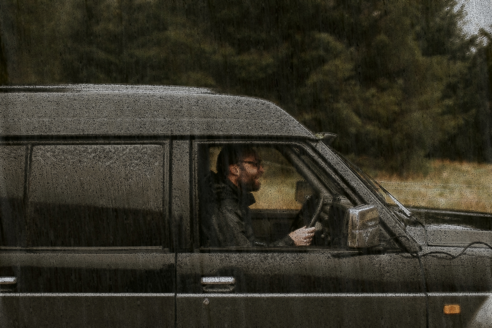
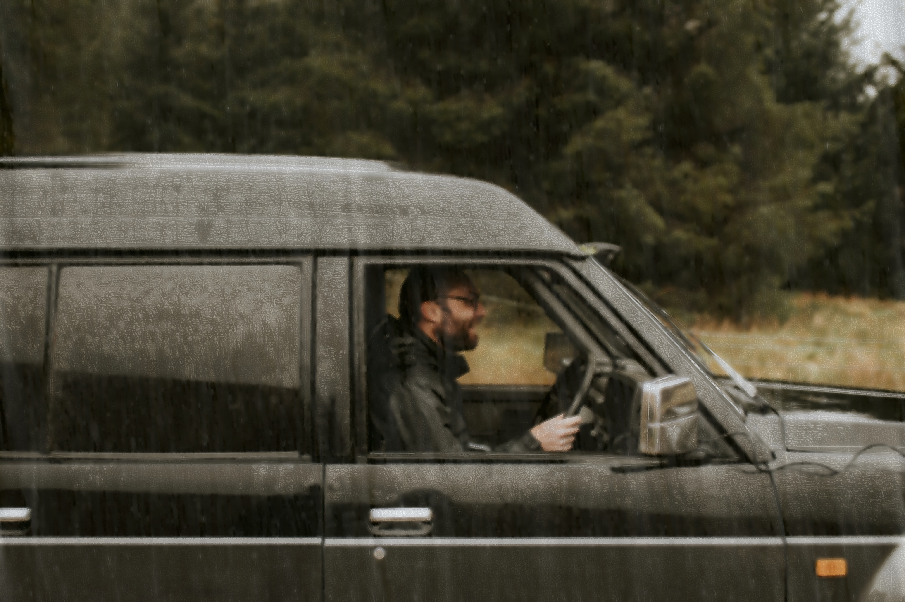

# Image_Deraining_For_Autonomous_Driving

### **Overview**

This project tackles the critical issue of reduced visibility in adverse weather conditions, focusing on **image deraining** for autonomous driving. Rain obstructs the visibility of road features, leading to potential safety hazards for perception and decision-making systems in autonomous vehicles. This project employs **non-learning-based techniques** to enhance visibility in real-time without relying on extensive training datasets, ensuring adaptability and efficiency in diverse and challenging rain scenarios.

---

## **Problem Statement**

Autonomous driving systems depend heavily on clear and accurate visual data. Rain introduces challenges that include:

- **Visibility Obstruction**: Rain streaks, water droplets, and splashes distort the camera view, obscuring road markings and obstacles.
- **Dynamic Weather Conditions**: Variations in rain intensity, angles, and environments make it difficult to generalize solutions.
- **Latency Requirements**: Autonomous systems require low-latency processing to make split-second decisions. Many learning-based approaches fail to meet these real-time demands.

### Why Non-Learning-Based Approaches?

Deep learning models have been widely used for image enhancement, but they face limitations:
1. **Dependence on Large Training Datasets**:
   - Collecting diverse datasets for all possible rain scenarios is impractical.
   - Generalization to unseen rain conditions remains a challenge.
2. **High Computational Overhead**:
   - Learning-based models are computationally intensive, leading to increased latency.
   - Real-time applications, such as autonomous driving, demand faster processing.
3. **Adaptability**:
   - Non-learning-based approaches offer adaptability without retraining, making them suitable for diverse and dynamic environments.

---

## **Project Objectives**

This project proposes a **non-learning-based deraining system** using classical image processing techniques and frequency-domain transformations to:
1. **Improve Visibility**: Remove rain streaks and enhance image clarity for autonomous driving perception systems.
2. **Ensure Real-Time Performance**: Provide low-latency processing suitable for real-world applications.
3. **Enhance Generalization**: Adapt to diverse and unseen rain conditions without the need for training datasets.

---

## **Methodology**

### 1. **Classical Image Processing**
- Rain streaks and obstructions are identified and removed using:
  - Edge detection
  - Frequency filtering
  - Contrast enhancement

### 2. **Frequency-Domain Transformations**
- Transforming images into the frequency domain allows precise separation of rain artifacts from useful image features.

### 3. **Pipeline Structure**
- The processing pipeline includes:
  - **Rain Detection**: Identifies rain streaks using edge-enhanced filtering techniques.
  - **Artifact Removal**: Applies frequency-based methods to selectively remove rain artifacts.
  - **Image Restoration**: Enhances contrast and restores image clarity while preserving essential details.

---

## **Project Features**

1. **Python Implementation**:
   - All algorithms are implemented in Python for simplicity and flexibility.
2. **Real-Time Focus**:
   - Designed to meet the low-latency demands of autonomous driving systems.
3. **No Dependency on Training Datasets**:
   - Completely independent of deep learning models or pre-trained networks.

---

## **Repository Structure**

```plaintext
Image_Deraining_For_Autonomous_Driving/
├── data/                    # Example input images
├── filters.py               # Core filter implementations
├── deraining_filter.py      # Comprehensive deraining pipeline
├── utils.py                 # Utility functions
├── main.py                  # Main script for processing
├── README.md                # Repository guide
├── clear_recovered.jpg      # Output image: clear recovery example
├── edge_enhanced.jpg        # Output image: edge-enhanced example
├── recovered.jpg            # Output image: rain removal
└── test2.png                # Sample input image
```

---

## **How to Use**

1. Clone the repository:
   ```bash
   git clone https://github.com/bob020416/Image_Deraining_For_Autonomous_Driving.git
   ```

2. Navigate to the project directory:
   ```bash
   cd Image_Deraining_For_Autonomous_Driving
   ```

3. Install required dependencies:
   ```bash
   pip install -r requirements.txt
   ```

4. Run the main script with a test image:
   ```bash
   python main.py --input data/test_image.jpg --output results/derained_image.jpg
   ```

---

## **Results**

### Example Output
1. **Input Image with Rain**:
   

2. **Edge-Enhanced Image**:
   

3. **Recovered Image (Rain Removed)**:
   

---

## **Future Enhancements**

- Extend the pipeline to handle other adverse weather conditions like snow and fog.
- Optimize the algorithms for deployment on edge devices used in autonomous vehicles.
- Explore hybrid approaches combining classical and lightweight learning-based techniques for enhanced performance.

---

### **Let’s Drive Clearer with Advanced Image Processing!**
